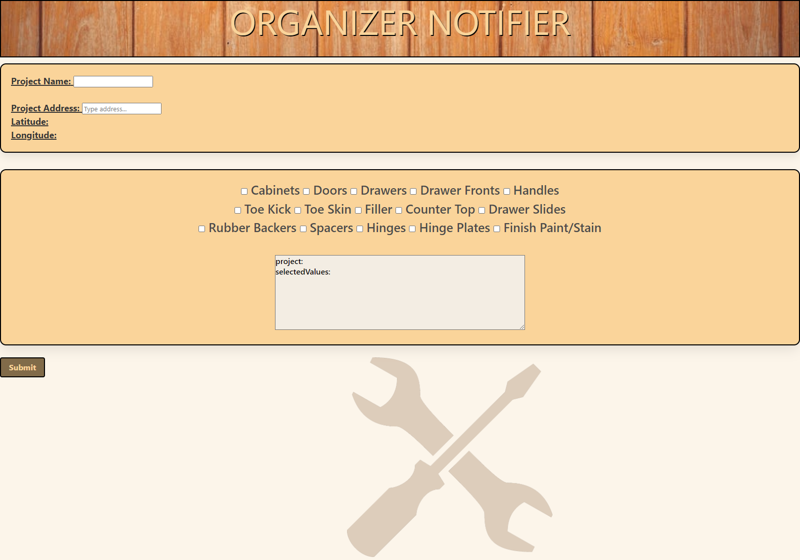

# Project-Organizer-Notifier
The purpose of this project is to create a resource for communicating between multiple departments, in this case within a carpentry bussiness. To minimize the miscommunications that can occur between multiple departments, this resource will allow one department to enter the name of a project and below it select from a series of checkboxes which aspects of the project are complete and ready for the field. Once a project is named and boxes selected, the user can click a submit button at the bottom which will populate and send an email contatining the values from the text field, where the project name is entered, and the selected checkboxes. This allows the shop which makes the project to know what is completed, the delivery team what is ready to be delivered, the install team what can be installed and the administration team what can be billed at the end of the week. 

## User-Story
As a carpenter I want to be organized and communicate with multiple departments so we all operate on the same page and in step. What that looks like for this application is when a project is selected and named the shop can select multiple completed componenets and when submitted, the other departments receive an email notifying them of such. 
## Build With
* HTML
* CSS
* JaveScript
* jQuery
* serverSide APIs
* TailWind
## Credits
The deployment was completed by the following developers:

Scott Mazariego 

Bryce Poole

Nic Verdi

Jean Balbuena 

Lepeng Zhang

# Websites

The link to the deployed application: https://smazariego.github.io/Project-Organizer-Notifier/

GitHub Repository：https://github.com/SMazariego/Project-Organizer-Notifier.git

# Application Preview

# API Resources

Email API: https://www.emailjs.com/

Google map API: https://developers.google.com/maps/documentation/javascript/get-api-key